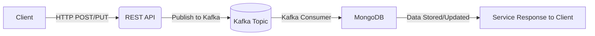

# Mega Microservices project 

 This project exemplifies a microservice architecture using a powerful tech stack that includes **Go**, **Kafka**, **gRPC**, **MongoDB**, **Redis**, **Prometheus**, **Grafana**, **Jaeger**, and more. 
  showcasex how to build, execute, and monitor a microservice designed to manage product data using both REST and gRPC interfaces while harnessing Kafka for asynchronous communication.

---

### What Has Been Used

- **[Kafka](https://github.com/segmentio/kafka-go)** – Kafka client library in Go
- **[gRPC](https://grpc.io/)** – gRPC framework
- **[echo](https://github.com/labstack/echo)** – Web framework for REST endpoints
- **[viper](https://github.com/spf13/viper)** – Configuration management
- **[go-redis](https://github.com/go-redis/redis)** – Redis client for Golang
- **[zap](https://github.com/uber-go/zap)** – High-performance logging library
- **[validator](https://github.com/go-playground/validator)** – Struct and field validation 
- **[swag](https://github.com/swaggo/swag)** – Auto-generation of Swagger docs
- **[CompileDaemon](https://github.com/githubnemo/CompileDaemon)** – Automatic recompilation for Go
- **[Docker](https://www.docker.com/)** – Containerization
- **[Prometheus](https://prometheus.io/)** – Metrics and monitoring
- **[Grafana](https://grafana.com/)** – Visualization dashboards
- **[Jaeger](https://www.jaegertracing.io/)** – Distributed tracing
- **[MongoDB](https://github.com/mongodb/mongo-go-driver)** – Go driver for MongoDB
- **[retry-go](https://github.com/avast/retry-go)** – Simple retry mechanism
- **[kafdrop](https://github.com/obsidiandynamics/kafdrop)** – Kafka Web UI

---

## Service Overview

1. **HTTP + gRPC Server**
   - REST endpoints available at port **5007** (via [Echo](https://echo.labstack.com/)).
   - gRPC server listens on port **5000** (configurable).
   - Access Swagger UI at `/swagger/index.html`.
   - Health check at `/health`.

2. **MongoDB**
   - Houses primary data for product documents.
   - Interacts via the Go Mongo driver.

3. **Kafka**
   - Employs `create-product` and `update-product` topics for product management.
   - Consumer group processes messages, affecting MongoDB.

4. **Redis**
   - Utilized for caching or ephemeral data.

5. **Observability**
   - **Prometheus** and **Grafana** for metrics.
   - **Jaeger** for distributed tracing.

---

## Architecture Flow




🌐 Access URLs (Local Environment)
Service	URL
Jaeger	http://localhost:16686
Prometheus	http://localhost:9090
Grafana	http://localhost:3000
Kafdrop	http://localhost:9000/
Swagger UI	http://localhost:5007/swagger/index.html 
> Note: Port mappings may vary based on your Docker setup.

1. Client calls create/update product API via HTTP or gRPC.
2. Service validates and publishes a message to Kafka.
3. Kafka receives the message; consumer processes it.
4. MongoDB is asynchronously updated by the consumer.
5. The REST/gRPC request returns success once the message is published. The product is eventually updated in Mongo.


---

## How to Run

### Option A: Docker Compose

1. Clone the repository.
2. Navigate to the project's root directory.
3. Start with:

   ```bash
   docker-compose up --build
   ```

   This initializes the microservice, Kafka, MongoDB, Redis, Prometheus, Grafana, Jaeger, etc.

   Alternatively, run:

   ```bash
   docker-compose -f docker-compose.local.yml up --build
   ```

**Verify:**

- Service at [http://localhost:5007](http://localhost:5007).
- Kafka on ports 9091, 9092, 9093.
- MongoDB on port 27017.

### Option B: Makefile Commands

- Start with (recommened): 

  ```bash
  make develop
  ```

  or:

  ```bash
  make local
  ```

- Stop containers:

  ```bash
  make down-local
  ```

- Clean Docker system:

  ```bash
  make clean
  ```

---

## Testing the Endpoints

1. **Health Check**

   ```bash
   curl -i http://localhost:5007/health
   ```

   Expected: `200 OK` and "Ok" in body.

2. **Swagger UI Visit**

   Access [http://localhost:5007/swagger/index.html](http://localhost:5007/swagger/index.html) to view the Swagger docs.

3. **Create a New Product**

   ```bash
   curl -i -X POST http://localhost:5007/api/v1/products \
     -H "Content-Type: application/json" \
     -d '{ "categoryId": "64e5e0c2b591a09b168e8c21", "name": "Sample Product", "description": "A test product", "price": 12.99, "quantity": 5, "rating": 7, "imageUrl": "https://example.com/img.jpg", "photos": ["https://example.com/img1.jpg", "https://example.com/img2.jpg"] }'
   ```

   Expected: `201 Created`. Publishes a message to `create-product` topic. Consumer inserts into MongoDB.

4. **Update a Product**

   ```bash
   curl -i -X PUT http://localhost:5007/api/v1/products/64e5e0c2b591a09b168e8c21 \
     -H "Content-Type: application/json" \
     -d '{ "categoryId": "64e5e0c2b591a09b168e8c21", "name": "Updated Product", "description": "Updated description", "price": 20.99, "quantity": 10, "rating": 9, "imageUrl": "https://example.com/new.jpg", "photos": ["https://example.com/new1.jpg", "https://example.com/new2.jpg"] }'
   ```

   Expected: `200 OK`. Publishes a message to `update-product`. Consumer updates MongoDB.

5. **Get a Product by ID**

   ```bash
   curl -i http://localhost:5007/api/v1/products/64e5e0c2b591a09b168e8c21
   ```

   Expected: `200 OK` and JSON body of the product. If Kafka hasn’t processed the message, you might encounter an error or missing product data.
